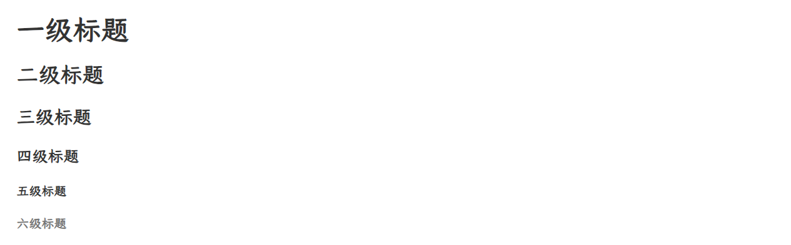
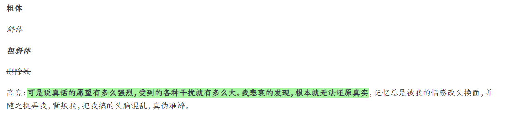
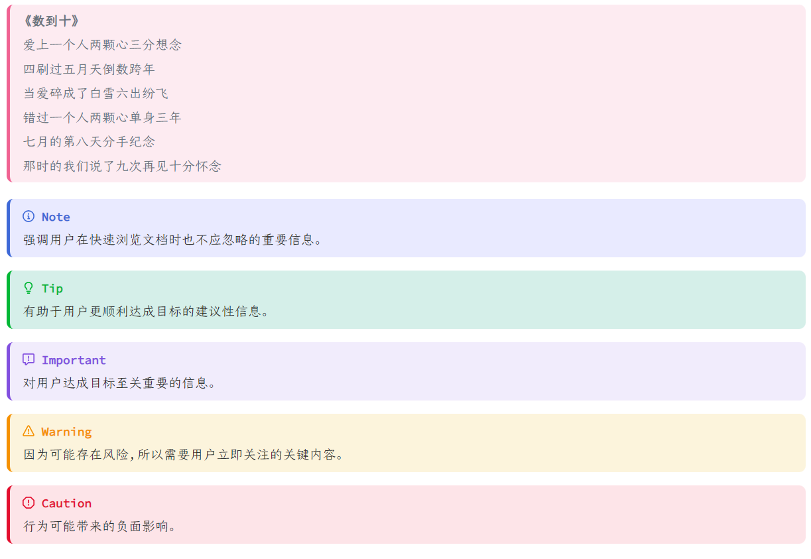
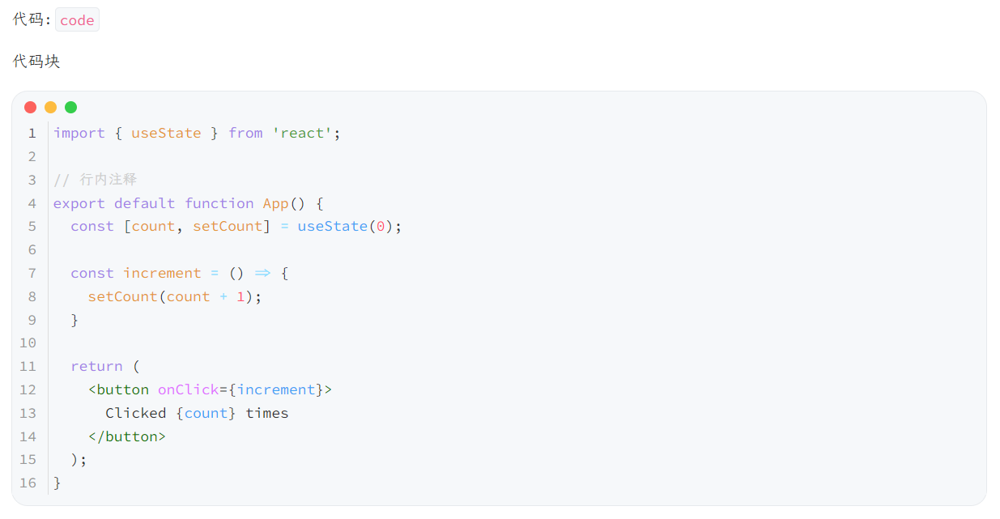
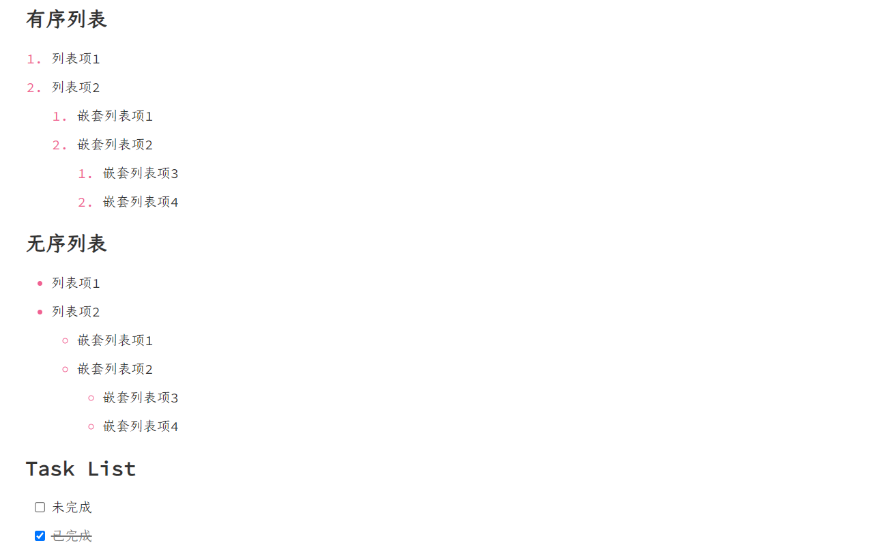
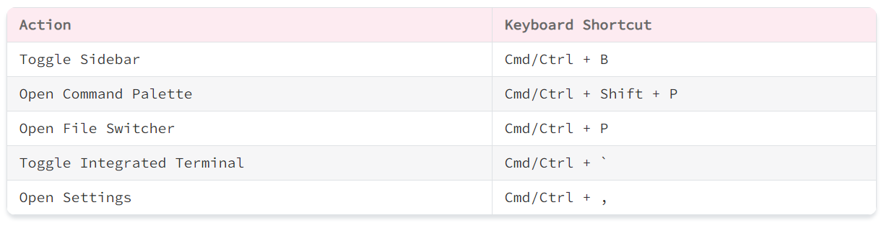
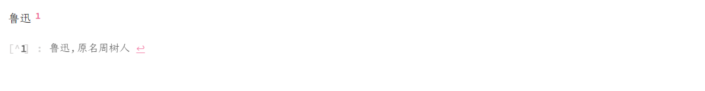
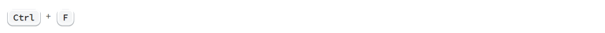
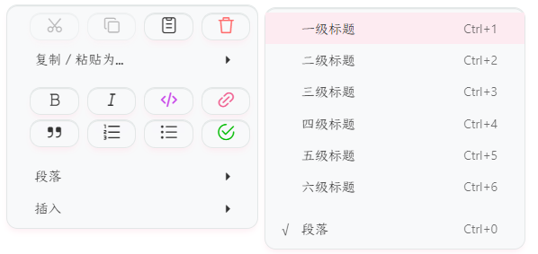
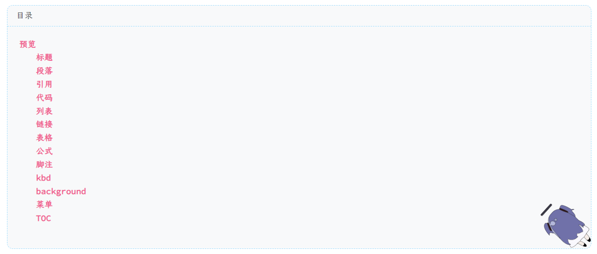

# 预览

## 标题



## 段落



## 引用

```
> [!NOTE]
> 强调用户在快速浏览文档时也不应忽略的重要信息。

> [!TIP]
> 有助于用户更顺利达成目标的建议性信息。

> [!IMPORTANT]
> 对用户达成目标至关重要的信息。

> [!WARNING]
> 因为可能存在风险，所以需要用户立即关注的关键内容。

> [!CAUTION]
> 行为可能带来的负面影响。
```



## 代码



## 列表



## 链接


## 表格



## 公式


## 脚注



## kbd



## background

在 `kyogre_light.css` 引入

```css
@import './kyogre/features/background.css';
```


## 菜单

 

## TOC




